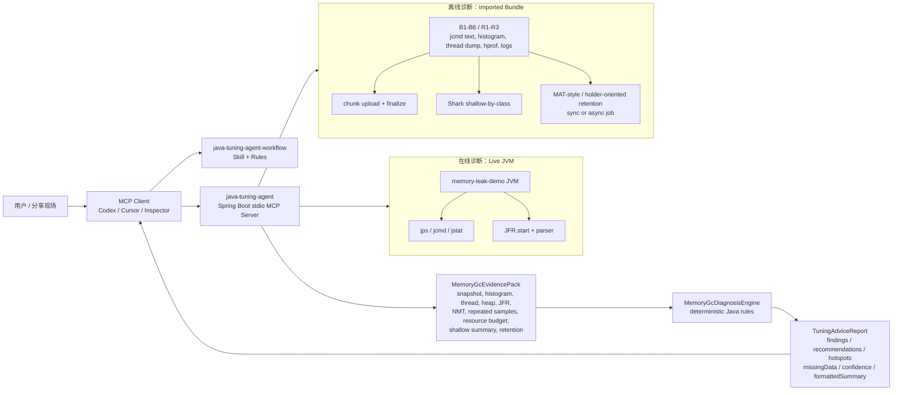

# Java Tuning Agent Sharing Slides

> 目标：用 10-15 分钟讲清楚项目价值、架构、工具面，以及在线/离线两条 demo 主线。
> 形式：Markdown slides，按 `---` 分页。

---

## 这次分享想留下的印象

- JVM tuning 不应该只靠“专家手动翻 jcmd 输出”
- 我们把诊断经验沉淀成了 **MCP tools + workflow skill + rule-based report**
- 在线：对本机 JVM 做发现、快照、趋势、证据采集、JFR、结论生成
- 离线：对生产导出的 bundle / heap dump 做校验、浅层/深层分析、结论生成
- 重点不是“AI 替人猜”，而是“Agent 按安全流程编排确定性的诊断工具”

---

## 相比传统 JVM tuning，我们解决了什么


| 传统方式                               | Java Tuning Agent                                               |
| ---------------------------------- | --------------------------------------------------------------- |
| 靠专家记命令、拼上下文                        | 自然语言触发，Agent 按 workflow 编排                                      |
| `jcmd` / `jstat` / dump / JFR 输出割裂 | 统一进 `MemoryGcEvidencePack`，最后复用同一份 evidence                     |
| tuning 结论口径不稳定                     | Java rule-based engine 产出 findings / recommendations / hotspots |
| 专家容易自由发挥                           | skill / rules 固化顺序、授权、输出格式                                      |
| 步骤繁琐                               | 几乎可以做到一键式                                                       |


---

## 技术架构总览




---

## MCP Tools 总览


| 类别           | Tools                                                                                    | 分享时一句话                                                |
| ------------ | ---------------------------------------------------------------------------------------- | ----------------------------------------------------- |
| 在线发现         | `listJavaApps`                                                                           | 先找到要分析的 JVM                                           |
| 在线轻量快照       | `inspectJvmRuntime`                                                                      | 只读 baseline：堆、GC、flags                                |
| 在线趋势         | `inspectJvmRuntimeRepeated`                                                              | 短窗口重复采样，看趋势而不是单点                                      |
| 在线 profiling | `recordJvmFlightRecording`                                                               | 需要 allocation / contention / CPU sample 时开短 JFR       |
| 在线证据采集       | `collectMemoryGcEvidence`                                                                | histogram、thread dump、heap dump、NMT、classloader stats |
| 在线建议         | `generateTuningAdvice`                                                                   | 一步式快速体验                                               |
| 在线证据复用建议     | `generateTuningAdviceFromEvidence`                                                       | 推荐主线：用刚才那份 evidence 出报告                               |
| 离线草稿校验       | `validateOfflineAnalysisDraft`                                                           | 检查 B1-B6 / 推荐项 / 目标一致性                                |
| 离线 heap 上传   | `submitOfflineHeapDumpChunk`, `finalizeOfflineHeapDump`                                  | 大 `.hprof` 分块上传、合并校验                                  |
| 离线建议         | `generateOfflineTuningAdvice`                                                            | 导入 bundle 后走同一套诊断引擎                                   |
| 离线 heap 浅层   | `summarizeOfflineHeapDumpFile`                                                           | Shark shallow-by-class，快看堆里什么类型大                      |
| 离线 retention | `analyzeOfflineHeapRetention`                                                            | MAT-style holder / 引用链 / classloader 维度线索             |
| 离线异步任务       | `startOfflineHeapRetentionAnalysis`, `getOfflineAnalysisJob`, `cancelOfflineAnalysisJob` | deep 或大 dump 不堵单次 MCP call                            |


---

## Skills / Rules 总览


| 资产                                 | 位置                                                                | 作用                                          |
| ---------------------------------- | ----------------------------------------------------------------- | ------------------------------------------- |
| `java-tuning-agent-workflow` skill | `.cursor/skills/java-tuning-agent-workflow/SKILL.md`              | 固化在线/离线诊断顺序、授权 gate、报告渲染要求                  |
| Tool reference                     | `.cursor/skills/java-tuning-agent-workflow/reference.md`          | 记录参数形状、offline draft JSON、token 约定          |
| Cursor MCP rule                    | `.cursor/rules/java-tuning-agent-mcp.mdc`                         | 让 Cursor Agent 优先使用正确 MCP server 和 workflow |
| Agent pack skill                   | `agent-pack/java-tuning-agent/skills/java-tuning-agent-workflow/` | 发布给 Codex / Cursor / Copilot 的可安装 skill     |
| MCP schema JSON                    | `mcps/user-java-tuning-agent/tools/*.json`                        | 客户端可读的 tool input schema，16 个工具逐个导出         |


---

## 被测试 Demo 项目

`compat/memory-leak-demo` 是一个 Spring Boot demo，默认端口 `8091`。


| 场景                 | Endpoint                              | 用来展示                                           |
| ------------------ | ------------------------------------- | ---------------------------------------------- |
| retained records   | `POST /api/leak/allocate`             | 业务对象持有 payload，映射源码热点                          |
| raw bytes          | `POST /api/leak/raw/allocate`         | `[B` / `byte[]` 在 histogram 和 heap summary 里突出 |
| direct buffer      | `POST /api/leak/direct/allocate`      | NMT `NIO` / direct memory pressure             |
| classloader growth | `POST /api/leak/classloader/allocate` | class count / metaspace / classloader stats    |
| young GC churn     | `POST /api/leak/churn`                | repeated sampling 里的 YGC 趋势                    |
| JFR workload       | `POST /api/leak/jfr-workload`         | JFR allocation / contention / execution sample |
| CPU burn           | `POST /api/leak/cpu/start`            | Thread.print CPU rows / JFR execution sample   |
| deadlock           | `POST /api/leak/deadlock/trigger`     | thread dump deadlock hints                     |


---

## Demo 命令：PowerShell

```powershell
# 1. 启动 demo。若要展示 direct/native memory，保留 NMT 参数。
mvn -f compat/memory-leak-demo/pom.xml spring-boot:run "-Dspring-boot.run.jvmArguments=-Xms128m -Xmx256m -XX:+UseG1GC -XX:NativeMemoryTracking=summary"

# 2. 制造 heap retained records 和 raw bytes。
curl.exe --% -X POST http://localhost:8091/api/leak/allocate -H "Content-Type: application/json" -d "{\"entries\":120,\"payloadKb\":512,\"tag\":\"round-1\"}"
curl.exe --% -X POST http://localhost:8091/api/leak/raw/allocate -H "Content-Type: application/json" -d "{\"entries\":200,\"payloadKb\":256,\"tag\":\"raw-b\"}"

# 3. 可选：native/direct buffer、classloader/metaspace、young GC churn。
curl.exe --% -X POST http://localhost:8091/api/leak/direct/allocate -H "Content-Type: application/json" -d "{\"entries\":128,\"payloadKb\":1024,\"tag\":\"direct-128m\"}"
curl.exe --% -X POST http://localhost:8091/api/leak/classloader/allocate -H "Content-Type: application/json" -d "{\"loaders\":1000,\"tag\":\"proxy-loaders\"}"
curl.exe --% -X POST http://localhost:8091/api/leak/churn -H "Content-Type: application/json" -d "{\"iterations\":2000000,\"payloadBytes\":4096}"

# 4. 可选：JFR 录制窗口内打 workload；或启动后台 CPU burn 后采 Thread.print / JFR。
curl.exe --% -X POST http://localhost:8091/api/leak/jfr-workload -H "Content-Type: application/json" -d "{\"durationSeconds\":20,\"workerThreads\":4,\"payloadBytes\":4096}"
curl.exe --% -X POST http://localhost:8091/api/leak/cpu/start -H "Content-Type: application/json" -d "{\"durationSeconds\":60,\"workerThreads\":2}"
curl.exe -X POST http://localhost:8091/api/leak/cpu/status
curl.exe -X POST http://localhost:8091/api/leak/cpu/stop
curl.exe -X POST http://localhost:8091/api/leak/deadlock/trigger

# 5. 导出离线 bundle。<pid> 替换成 memory-leak-demo 的 PID；需要离线 JFR 时加 -RecordJfr。
.\scripts\export-jvm-diagnostics.ps1 -ExportDir 'C:\tmp\memory-leak-demo-offline' -ProcessId <pid> -SampleCount 3 -SampleIntervalSeconds 5 -RecordJfr -JfrDurationSeconds 30 -JfrSettings profile

# 6. 清理 retained stores，方便下一轮演示。
curl.exe -X POST http://localhost:8091/api/leak/clear
curl.exe -X POST http://localhost:8091/api/leak/raw/clear
curl.exe -X POST http://localhost:8091/api/leak/direct/clear
curl.exe -X POST http://localhost:8091/api/leak/classloader/clear
curl.exe -X POST http://localhost:8091/api/leak/cpu/stop
```

---

## Demo 命令：Bash

```bash
# 1. 启动 demo。若要展示 direct/native memory，保留 NMT 参数。
mvn -f compat/memory-leak-demo/pom.xml spring-boot:run \
  -Dspring-boot.run.jvmArguments="-Xms128m -Xmx256m -XX:+UseG1GC -XX:NativeMemoryTracking=summary"

# 2. 制造 heap retained records 和 raw bytes。
curl -X POST http://localhost:8091/api/leak/allocate -H 'Content-Type: application/json' -d '{"entries":120,"payloadKb":512,"tag":"round-1"}'
curl -X POST http://localhost:8091/api/leak/raw/allocate -H 'Content-Type: application/json' -d '{"entries":200,"payloadKb":256,"tag":"raw-b"}'

# 3. 可选：native/direct buffer、classloader/metaspace、young GC churn。
curl -X POST http://localhost:8091/api/leak/direct/allocate -H 'Content-Type: application/json' -d '{"entries":128,"payloadKb":1024,"tag":"direct-128m"}'
curl -X POST http://localhost:8091/api/leak/classloader/allocate -H 'Content-Type: application/json' -d '{"loaders":1000,"tag":"proxy-loaders"}'
curl -X POST http://localhost:8091/api/leak/churn -H 'Content-Type: application/json' -d '{"iterations":2000000,"payloadBytes":4096}'

# 4. 可选：JFR 录制窗口内打 workload；或启动后台 CPU burn 后采 Thread.print / JFR。
curl -X POST http://localhost:8091/api/leak/jfr-workload -H 'Content-Type: application/json' -d '{"durationSeconds":20,"workerThreads":4,"payloadBytes":4096}'
curl -X POST http://localhost:8091/api/leak/cpu/start -H 'Content-Type: application/json' -d '{"durationSeconds":60,"workerThreads":2}'
curl -X GET http://localhost:8091/api/leak/cpu/status
curl -X POST http://localhost:8091/api/leak/cpu/stop
curl -X POST http://localhost:8091/api/leak/deadlock/trigger

# 5. 导出离线 bundle。<pid> 替换成 memory-leak-demo 的 PID；需要离线 JFR 时加 --record-jfr。
scripts/export-jvm-diagnostics.sh --export-dir /tmp/memory-leak-demo-offline --process-id <pid> --sample-count 3 --sample-interval-seconds 5 --record-jfr --jfr-duration-seconds 30 --jfr-settings profile

# 6. 清理 retained stores，方便下一轮演示。
curl -X POST http://localhost:8091/api/leak/clear
curl -X POST http://localhost:8091/api/leak/raw/clear
curl -X POST http://localhost:8091/api/leak/direct/clear
curl -X POST http://localhost:8091/api/leak/classloader/clear
curl -X POST http://localhost:8091/api/leak/cpu/stop
```

---

## Demo：在线诊断模式

讲法：始终用用户意图表达，不用先解释 tool 名。

1. 定位目标 JVM

```text
请帮我看看当前机器有哪些 Java 进程，我要分析 memory-leak-demo。
```

2. 做轻量快照

```text
对这个 memory-leak-demo PID 做一次轻量 JVM 快照，先看堆使用、GC、JVM flags 和基础风险。
```

3. 选择证据范围

```text
我确认继续采集更强证据：class histogram、thread dump、heap dump，并补充 classloader stats。
heap dump 可以写到 /tmp/memory-leak-demo-<pid>.hprof。
```

4. 生成报告

```text
请复用刚才采集到的 evidence 生成 tuning report，不要重复采集。
源码在 compat/memory-leak-demo，目标是诊断 memory leak 并降低 Full GC 风险。
```

---

## Demo：在线扩展能力

### repeated sampling

```text
请对这个 PID 做 3 次短窗口采样，间隔 5 秒，同时包含 thread count 和 class count。
我想看 classloader 增长和 YGC 趋势。
```

### JFR

```text
我同意录制一个 30 秒 JFR，settings 用 profile，输出到 /tmp/memory-leak-demo-<pid>.jfr。
录制期间我会触发 /api/leak/jfr-workload。
```

### high CPU

```text
我会先调用 /api/leak/cpu/start 启动后台 CPU burn。请在它运行期间采集 thread dump，并结合一个 30 秒 profile JFR 生成高 CPU 诊断建议。
重点看 Thread.print 里的 cpu=...ms / nid / RUNNABLE top frame，以及 JFR ExecutionSample 的 hottest frame。
```

---

## Demo：离线诊断模式

场景：生产环境不能直连 JVM，只拿到了导出材料。

生成离线报告

```text
请帮我做一个完整的离线JVM tuning分析。
我已经从生产/测试机导出了离线 bundle，目录是 /tmp/memory-leak-demo-offline。请基于 offline-draft-template.json 构建 OfflineBundleDraft，并先校验完整性。
然后用这份离线 bundle 生成 tuning advice，源码上下文是 compat/memory-leak-demo，analysisDepth 直接用 deep。
如果 draft 里有 jfrPathOrSummary，也请合并 JFR 证据；applicationName 是 MemoryLeakDemoApplication，
candidatePackage 是 com.alibaba.cloud.ai.compat.memoryleakdemo，analysisDepth 可以用 deep。
```

---

## Next Steps：做得更广

- 支持更多诊断目标：从 memory / GC 扩展到 CPU、锁竞争、线程池、连接池、IO、启动慢等场景
- 支持更多运行时信号：GC log、JFR、NMT、heap retention、应用日志、Prometheus 指标可以继续统一到 evidence model
- 支持更多 Agent 客户端：Codex、Cursor、Copilot、Inspector 使用同一套 MCP schema 和 workflow skill
- 支持更多知识沉淀：把常见问题模式变成 rule、checklist、demo case，而不是只停留在一次性的排查经验

一句话：

> 横向扩展的方向，是把 JVM 诊断从“内存专项工具”逐步变成“Java 应用运行时诊断工作台”。

---

## Next Steps：做得更深

- Deep heap：继续增强 holder、引用链、classloader、retained-style 近似分析，让报告更接近“谁在持有对象”
- Evidence correlation：把 histogram、thread dump、JFR、GC log、源码热点放在同一个时间窗口里交叉验证
- Report quality：让 `findings`、`recommendations`、`confidence` 更稳定，减少“看起来像建议但缺证据”的输出
- Production playbook：沉淀不同问题的标准流程，比如 OOM、Full GC、direct memory、metaspace、deadlock、allocation spike

一句话：

> 纵向深入的方向，是从“能发现异常”走到“能解释根因，并给出可信的下一步验证”。

---

## Next Steps：容器内应用支持

容器里最大的变化是：目标 JVM 不一定和 MCP server 在同一个 namespace 里。

后续可以分三层做：


| 层次                 | 做法                                                   | 价值                             |
| ------------------ | ---------------------------------------------------- | ------------------------------ |
| Sidecar / same pod | Agent 或诊断 helper 与目标 JVM 同 pod，共享 PID / volume       | 最接近当前在线模式，可直接 `jcmd` / `jstat` |
| Kubernetes exec    | MCP tool 通过 `kubectl exec` 或平台 API 在目标 pod 内执行受控诊断命令 | 不侵入应用镜像，适合临时排查                 |
| Offline export     | 在容器内生成 bundle，再复制到分析端走离线模式                           | 生产权限更可控，也适合跨网络隔离场景             |


需要补齐的能力：

- Pod / container discovery：按 namespace、label、deployment、pod 选择目标，而不是只按本机 PID
- Container-aware evidence：采集 cgroup memory limit、RSS、CPU quota、OOMKilled、restart count、node / pod 资源上下文
- Path and permission model：heap dump / JFR 输出路径要落到可写 volume，避免写爆容器层
- Security boundary：明确哪些命令允许执行、谁批准、证据如何脱敏和清理

---

## 结尾

这个项目的核心价值不是“自动调参数”，而是：

- 把 JVM 诊断动作标准化
- 把证据采集和结论生成分开
- 把在线和离线放进同一套证据模型
- 把 Agent 的自由发挥约束成可审计 workflow
- 让 tuning 从个人经验，变成团队可复用的工程资产

